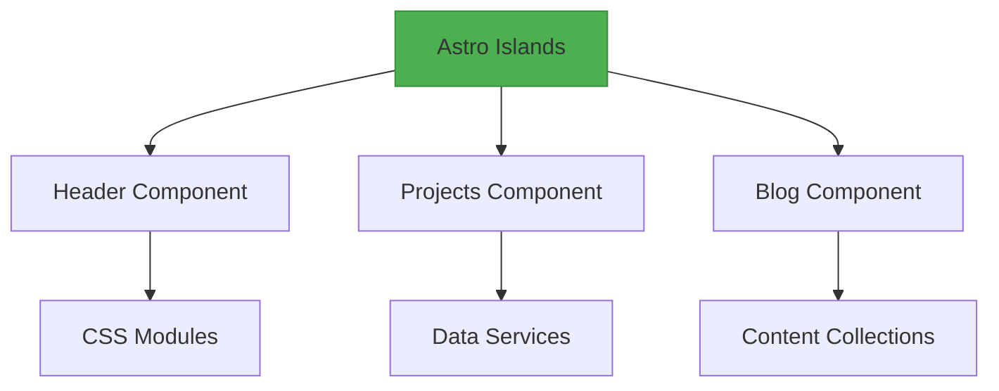
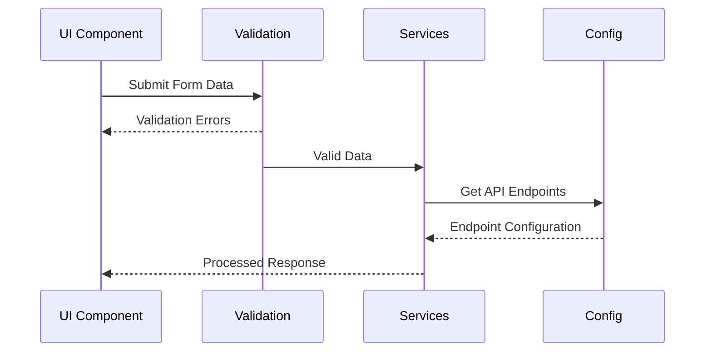

# 🏝️ Portfolio Architecture with Astro Islands

🌐 **Architecture Overview**


🔍 **Quick Navigation**
| Section | Description |
|---------|-------------|
|[Core Modules](#core-modules)| Configuration, Services, Validation |
|[Data Flow](#data-flow)| System interaction patterns |
|[Visual Guide](#visual-guide)| Architecture diagrams |


## Introduction

This document outlines the architecture of a portfolio website built using Astro Islands. The portfolio showcases various sections such as About, Projects, Contact, and Blog. Each section is implemented as an Astro Island, a self-contained component that can be reused across different parts of the portfolio.

#### Key Features

- **Type Safety**: Utilizes TypeScript for static type checking.
- **Modular Design**: Each island is self-contained and can be tested independently.
- **Reusability**: Islands can be reused across different parts of the portfolio.
- **Testability**: Each island can be easily tested independently.

#### Directory Structure

<details>
<summary>📁 Directory Structure Visualization</summary>

```mermaid
flowchart LR
    src/ --> islands/
    islands/ --> header/:::component
    islands/ --> projects/:::component
    islands/ --> blog/:::component
    classDef component fill:#90CAF9,stroke:#1E88E5

    src/ --> pages/
    pages/ --> index.astro:::page
    pages/ --> blog/[slug].astro:::page
    classDef page fill:#FFE082,stroke:#FFB300
```
</details>

```plaintext
src/
├── islands/
│   ├── header/
│   │   ├── Header.tsx
│   │   ├── header.module.css
│   │   └── index.ts
│   ├── footer/
│   │   ├── Footer.tsx
│   │   ├── footer.module.css
│   │   └── index.ts
│   ├── about/
│   │   ├── About.tsx
│   │   ├── about.module.css
│   │   └── index.ts
│   ├── projects/
│   │   ├── ProjectList.tsx
│   │   ├── project-list.module.css
│   │   └── index.ts
│   ├── contact/
│   │   ├── Contact.tsx
│   │   ├── contact.module.css
│   │   └── index.ts
│   ├── blog/
│   │   ├── BlogList.tsx
│   │   ├── blog-list.module.css
│   │   └── index.ts
├── pages/
│   ├── index.astro
│   ├── about.astro
│   ├── projects.astro
│   ├── contact.astro
│   ├── blog/
│   │   ├── [slug].astro
├── components/
│   ├── layouts/
│   ├── atoms/
│   ├── molecules/
│   ├── organisms/
│   ├── templates/
├── styles/
│   ├── global.css
├── scripts/
│   ├── config/
│   ├── services/
│   ├── utilities/
├── data/
│   ├── blog/
│   ├── projects/
├── public/
│   ├── favicon.ico
│   ├── robots.txt
├── astro.config.mjs
└── package.json
```

### Core Modules

#### Configuration Module (`src/scripts/config`)

- **Purpose**: Centralized management of API endpoints and runtime constants.
- **Features**:
  - Type-safe configuration access with `as const` assertions.
  - Contains API endpoints, default timeout values, and reusable error messages.

#### Services Layer (`src/scripts/services`)

- **Purpose**: Abstracts business logic and data operations.
- **Features**:
  - Unified error handling.
  - Configurable timeout support.
  - Standardized response handling.
  - Service isolation for testability.

#### Validation Utilities (`src/scripts/utilities`)

- **Purpose**: Provides reusable validation patterns and error messages.
- **Features**:
  - Configurable regex patterns.
  - Length validation constraints.
  - Localized error messages.
  - Atomic validation functions.

## 🌊 Data Flow



### System Flow

1. **UI Components → Validation Utilities**:
   - User input is validated using utility functions before being processed.

2. **Validated Data → API Services**:
   - Validated data is sent to the services layer for further processing or API calls.

3. **API Services → Configuration Module**:
   - Services use configurations from the configuration module to interact with APIs.

### Example: Header Island

**Header Component (`Header.tsx`)**:
```typescript
import React from 'react';
import './header.module.css';

const Header: React.FC = () => {
  return (
    <header className="header">
      <h1>My Portfolio</h1>
      <nav>
        <a href="/">Home</a>
        <a href="/about">About</a>
        <a href="/projects">Projects</a>
        <a href="/contact">Contact</a>
        <a href="/blog">Blog</a>
      </nav>
    </header>
  );
};

export default Header;
```

**Index File (`index.ts`)**:
```typescript
import Header from './Header';

export default Header;
```

**CSS Module (`header.module.css`)**:
```css
.header {
  background-color: #f8f9fa;
  padding: 20px;
  text-align: center;
}

.header nav a {
  margin: 0 15px;
  text-decoration: none;
  color: #007bff;
}
```

### Integrating Islands into Astro Pages

**Example: Home Page (`src/pages/index.astro`)**:
```astro
---
import Header from '../islands/header';
import Footer from '../islands/footer';
---

<html>
  <head>
    <title>Home</title>
  </head>
  <body>
    <Header />
    <main>
      <h2>Welcome to My Portfolio</h2>
      <p>This is the home page.</p>
    </main>
    <Footer />
  </body>
</html>
```

### Benefits of Using Astro Islands

- **Modularity**: Each island is a self-contained module, making the codebase easier to manage and scale.
- **Reusability**: Islands can be reused across different parts of the portfolio.
- **Testability**: Each island can be tested independently, ensuring robust and reliable code.
- **Maintainability**: The modular structure makes it easier to update and maintain the portfolio over time.

By applying the Astro Islands concept to your portfolio, you can create a well-organized, scalable, and maintainable architecture.


## Core Modules

### Configuration Module (`src/scripts/config`)
- Centralized management of API endpoints and runtime constants
- Type-safe configuration access with `as const` assertion
- Contains:
  - API endpoints
  - Default timeout values
  - Reusable error messages

### Services Layer (`src/scripts/services`)
- Abstracted business logic and data operations
- Key Features:
  - Unified error handling
  - Configurable timeout support
  - Standardized response handling
  - Service isolation for testability

### Validation Utilities (`src/scripts/utilities`)
- Reusable validation patterns and error messages
- Features:
  - Configurable regex patterns
  - Length validation constraints
  - Localized error messages
  - Atomic validation functions

## Data Flow
1. UI Components → Validation Utilities
2. Validated Data → API Services
3. API Services → Configuration Module

## Design Principles
- Single Source of Truth for configurations
- Separation of concerns between layers
- Runtime safety through type assertions
- Progressive enhancement of error handling
- Documentation-driven development