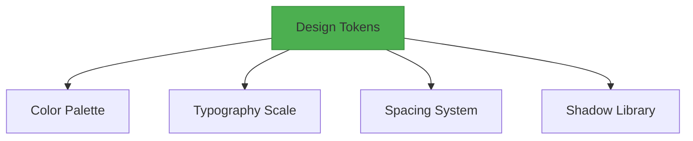
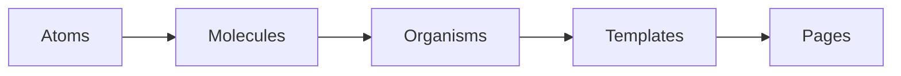

# Portfolio Design System

## Foundations


## Component Architecture


## Theming Implementation
```typescript
// src/styles/theme.ts
export const lightTheme = {
  colors: {
    primary: '#2563eb',
    surface: '#f8fafc',
    onSurface: '#020617'
  },
  shadows: {
    sm: '0 1px 3px rgba(0,0,0,0.12)'
  }
};
```

## Responsive Utilities
```css
/* src/styles/utilities.css */
@layer utilities {
  .responsive-grid {
    display: grid;
    grid-template-columns: repeat(auto-fit, minmax(min(300px, 100%), 1fr));
    gap: var(--space-4);
  }
  
  @media (prefers-reduced-motion: no-preference) {
    .fade-in {
      animation: fadeIn 0.3s ease-in;
    }
  }
}
```

## Implementation Guidelines
1. Atomic design structure
2. CSS Variables for theming
3. Mobile-first responsive approach
4. WCAG 2.1 AA compliance
5. Performance budgets

## Version History
`v1.0.0-beta` - Initial design system implementation