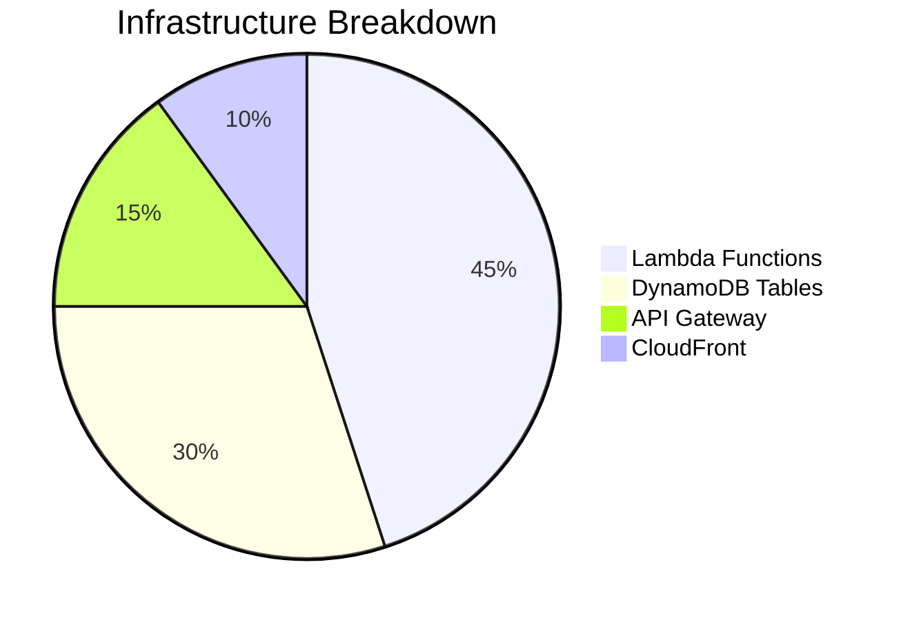

# 🚀 Amazon Web Services Expertise

## Featured Achievements

📈 **30% Sales Increase** through marketplace integrations  
🤖 **50% Process Automation** using serverless architectures  
🌐 **Multi-Region Deployment** with 99.99% uptime SLA



## Professional Experience

### Amazon Development Specialist

- **Role**: Lead architect for scalable e-commerce solutions using AWS.
- **Achievements**:
  - Designed and implemented multi-region deployment strategies.
  - Automated inventory management systems, reducing manual effort by 50%.
  - Integrated marketplace solutions that increased sales by 30%.

### Key Skills

- **AWS Architecture**: Expertise in designing scalable and resilient cloud solutions.
- **Automation**: Proficient in automating workflows and processes to enhance efficiency.
- **Integration**: Skilled in integrating third-party services and APIs for seamless operations.

## Notable Projects

- **Inventory Management Automation**: Developed a serverless solution using AWS Lambda and DynamoDB.
- **Marketplace Integration**: Led a team to integrate multiple marketplaces, enhancing product visibility.

```ts
// Sample infrastructure-as-code snippet
import * as aws from "@pulumi/aws";

const inventoryService = new aws.lambda.Function("InventoryService", {
  runtime: "nodejs18.x",
  handler: "index.handler",
  environment: {
    DYNAMO_TABLE: process.env.INVENTORY_TABLE_NAME,
  },
});
```
